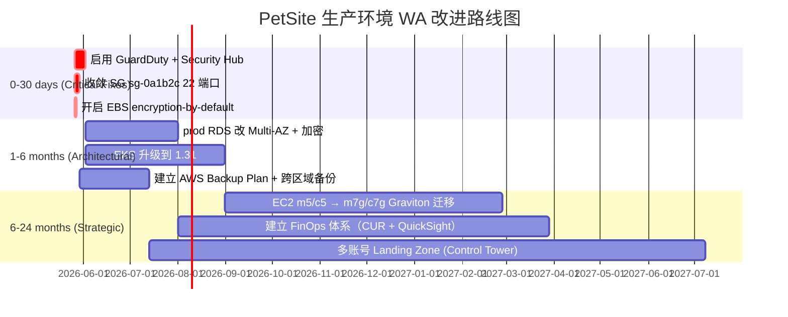

# 示例评估报告 — PetSite 生产账号

> 这是 `aws-well-architected-review-skill-devops` 的示例输出，使用虚构数据演示完整报告结构。真实运行时由 Agent 根据用户账号填充实际值。

---

## Assessment Metadata

| Field | Value |
|-------|-------|
| **Assessment Date** | 2026-05-25 |
| **Account ID** | 123456789012 |
| **Region** | ap-northeast-1 |
| **Framework** | AWS Well-Architected Framework (General, 6 pillars) |
| **Pillars Assessed** | Security, Reliability, Ops Excellence, Performance, Cost, Sustainability |
| **Mode** | Autopilot |
| **Assessor** | aws-well-architected-review-skill-devops v1.0 |
| **Credential** | arn:aws:iam::123456789012:role/WA-ReadOnly (ReadOnlyAccess) |

---

## Executive Summary

### Overall Health: 3.0 / 5 ⭐⭐⭐☆☆

PetSite 生产环境整体处于 *Adequate* 水平。Security 是最弱一环（2.5/5），主要问题是 GuardDuty 未启用 + 1 个 prod RDS 未开静态加密；Reliability 表现稳定（4/5），Multi-AZ 覆盖充分；Sustainability 和 Cost 因为大量旧代实例（m5/c5）拖低分数。

### Top 5 Risks

| # | Risk | Pillar | Severity | Quick Fix? |
|---|------|--------|----------|-----------|
| 1 | GuardDuty 未在 ap-northeast-1 启用 | Security | 🔴 CRITICAL | ✅ 一条 CLI 即可 |
| 2 | prod RDS `petsite-rds-prod` 未启用静态加密 | Security | 🟠 HIGH | ❌ 需 snapshot+restore |
| 3 | EKS 集群 `petsite-eks` 在 1.27 (已 EOL) | Reliability | 🟠 HIGH | ❌ 需滚动升级 + 回归 |
| 4 | 4 个 prod RDS 单 AZ 部署 | Reliability | 🟠 HIGH | ✅ 在线转 Multi-AZ |
| 5 | 17 个 m5 实例未升 m7g（旧代） | Performance / Sustainability | 🟡 MEDIUM | ⚠️ 需停机切换 |

### Three Immediate Recommendations

1. **本周内启用 GuardDuty**：单条命令、无停机、无业务影响。是 CRITICAL 级别中最容易拿下的。
2. **prod RDS Multi-AZ 改造**：在线转换、有 ~30s API 抖动窗口、月度 ×2 实例费但换来 RTO < 1 分钟。
3. **EKS 升级到 1.31+ 排期**：1.27 已停止 AWS 标准支持，扩展支持每集群每月加 $192 USD。3 个月内必须完成。

---

## Pillar Scorecards

| Pillar | Score | 🔴 | 🟠 | 🟡 | 🔵 |
|--------|-------|----|----|----|----|
| 🔒 Security | 2.5/5 | 1 | 2 | 4 | 1 |
| 🔄 Reliability | 4.0/5 | 0 | 2 | 3 | 1 |
| ⚙️ Ops Excellence | 3.5/5 | 0 | 1 | 4 | 2 |
| ⚡ Performance | 3.0/5 | 0 | 1 | 5 | 2 |
| 💰 Cost Optimization | 2.5/5 | 0 | 2 | 6 | 3 |
| 🌱 Sustainability | 2.5/5 | 0 | 1 | 4 | 1 |
| **Overall** | **3.0/5** | **1** | **9** | **26** | **10** |

---

## Detailed Findings — Security Pillar (sample)

### Identity & Access

| ID | Check | Severity | Finding | Down | Slow | Cost | Test | Remediation |
|----|-------|----------|---------|------|------|------|------|-------------|
| SEC-04 | IAM Password Policy | 🟡 MEDIUM | MinPasswordLength = 8 (低于 14) | 0 | 0 | 0 | 0 | `aws iam update-account-password-policy --minimum-password-length 14 --require-symbols --require-numbers --require-uppercase-characters --require-lowercase-characters --max-password-age 90 --password-reuse-prevention 24` |
| SEC-05 | IAM Access Keys Age | 🟠 HIGH | 3 个 IAM 用户 access key > 90 天 | 0 | 0 | 0 | 0 | `aws iam create-access-key --user-name {user}` 然后 `aws iam update-access-key --access-key-id {old} --status Inactive --user-name {user}` |
| SEC-06 | Root Account MFA | ⚪ INFO | Root MFA 已启用 ✅ | 0 | 0 | 0 | 0 | — |

**WA Mapping**: SEC-04→`SEC02.BP01`, SEC-05→`SEC02.BP05`, SEC-06→`SEC01.BP02`

### Data Protection

| ID | Check | Severity | Finding | Down | Slow | Cost | Test | Remediation |
|----|-------|----------|---------|------|------|------|------|-------------|
| SEC-08 | EBS Encryption Default | 🟡 MEDIUM | EBS encryption-by-default 未启用 | 0 | 0 | 0 | 0 | `aws ec2 enable-ebs-encryption-by-default --region ap-northeast-1` |
| SEC-10 | RDS Encryption | 🟠 HIGH | `petsite-rds-prod` 未加密 | 1 | 0 | 0 | 1 | Snapshot+restore：见 `wa-tool-sync.md` 完整命令 |

### Network Security

| ID | Check | Severity | Finding | Down | Slow | Cost | Test | Remediation |
|----|-------|----------|---------|------|------|------|------|-------------|
| SEC-09 | SG Public Ingress | 🔴 CRITICAL | sg-0a1b2c (`bastion-old`) 允许 22/tcp from 0.0.0.0/0 | -1 | 0 | 0 | 1 | `# ⚠️ verify before run: aws ec2 revoke-security-group-ingress --group-id sg-0a1b2c --protocol tcp --port 22 --cidr 0.0.0.0/0` 然后用 SSM Session Manager 替代 |

### Detection & Incident Response

| ID | Check | Severity | Finding | Down | Slow | Cost | Test | Remediation |
|----|-------|----------|---------|------|------|------|------|-------------|
| SEC-01 | GuardDuty | 🔴 CRITICAL | 未启用 | 0 | 0 | 1 | 0 | `aws guardduty create-detector --enable --finding-publishing-frequency FIFTEEN_MINUTES` |
| SEC-02 | Security Hub | 🟠 HIGH | 未启用 | 0 | 0 | 1 | 0 | `aws securityhub enable-security-hub --enable-default-standards` |
| SEC-11 | VPC Flow Logs | 🟡 MEDIUM | vpc-prod 无 Flow Logs | 0 | 0 | 1 | 0 | `aws ec2 create-flow-logs --resource-type VPC --resource-ids vpc-prod --traffic-type ALL --log-destination-type cloud-watch-logs --log-group-name /aws/vpc/flowlogs --deliver-logs-permission-arn arn:aws:iam::123456789012:role/FlowLogsRole` |

> 其余 5 个支柱按相同模板展开（略）。

---

## Improvement Roadmap



### Phase 1 (0-30 days) — Critical Fixes — 6 项

1. **启用 GuardDuty**（30 分钟）
   ```bash
   aws guardduty create-detector --enable --finding-publishing-frequency FIFTEEN_MINUTES
   ```
   月度成本：~$15 USD（按事件计费）

2. **启用 Security Hub**（10 分钟）
   ```bash
   aws securityhub enable-security-hub --enable-default-standards
   ```

3. **EBS Encryption-by-default**（即时）
   ```bash
   aws ec2 enable-ebs-encryption-by-default --region ap-northeast-1
   ```

4. **收敛 bastion-old SG**（30 分钟，含验证）
   ```bash
   # 1. 确认无活跃 SSH 会话
   aws ec2 describe-instances --filters Name=instance.group-id,Values=sg-0a1b2c
   # 2. 收敛
   aws ec2 revoke-security-group-ingress --group-id sg-0a1b2c --protocol tcp --port 22 --cidr 0.0.0.0/0
   # 3. 改用 SSM Session Manager
   aws ssm start-session --target i-xxxxx
   ```

5-6. （略）

### Phase 2 (1-6 months) — Architectural — 9 项
（略）

### Phase 3 (6-24 months) — Strategic — 4 项
（略）

---

## Quick Wins

操作员今天就能粘贴执行的 7 个修复：

```bash
# 1. GuardDuty
aws guardduty create-detector --enable --finding-publishing-frequency FIFTEEN_MINUTES

# 2. Security Hub
aws securityhub enable-security-hub --enable-default-standards

# 3. EBS 默认加密
aws ec2 enable-ebs-encryption-by-default --region ap-northeast-1

# 4. KMS Key 自动轮换（针对 customer-managed 但未轮换的 key）
for key in $(aws kms list-keys --query 'Keys[].KeyId' --output text); do
  aws kms enable-key-rotation --key-id "$key" 2>/dev/null
done

# 5. 强化 IAM 密码策略
aws iam update-account-password-policy \
  --minimum-password-length 14 \
  --require-symbols --require-numbers \
  --require-uppercase-characters --require-lowercase-characters \
  --max-password-age 90 --password-reuse-prevention 24

# 6. S3 账户级 Public Access Block
aws s3control put-public-access-block --account-id 123456789012 \
  --public-access-block-configuration BlockPublicAcls=true,IgnorePublicAcls=true,BlockPublicPolicy=true,RestrictPublicBuckets=true

# 7. VPC Flow Logs
aws ec2 create-flow-logs --resource-type VPC --resource-ids vpc-prod \
  --traffic-type ALL --log-destination-type cloud-watch-logs \
  --log-group-name /aws/vpc/flowlogs \
  --deliver-logs-permission-arn arn:aws:iam::123456789012:role/FlowLogsRole
```

预计总耗时：< 2 小时。月度新增成本：约 $20-40 USD。

---

## Appendix

### A. Checks Marked UNABLE_TO_ASSESS

| Check ID | Reason |
|----------|--------|
| OPS-04 | 当前角色无 `ssm:DescribeInstanceInformation` 权限 |
| COST-06 | Cost Explorer 未启用，需账户管理员先打开 |

### B. Checks Marked NOT_APPLICABLE

| Check ID | Reason |
|----------|--------|
| REL-08 | 无 DynamoDB 表 |
| REL-06 | （已覆盖在 Reliability 主报告） |

### C. Methodology

- Framework：AWS Well-Architected Framework (2025)
- Total checks：49（程序化）+ ~150 BP（建议访谈补全，本次未执行）
- Coverage：本次仅程序化部分；完整 WA Review 需配合架构访谈，参见 `references/mapping-table.md`
