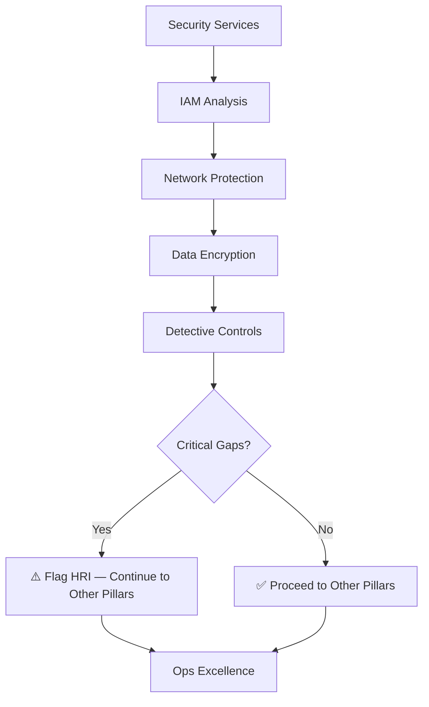

# Security-First Assessment Guide

## Why Security First?

Security forms the foundation of all Well-Architected principles:

1. **Prevents catastrophic loss**: A single security breach can cost more than all other optimizations save
2. **Enables visibility**: Security services (GuardDuty, CloudTrail, Security Hub) provide monitoring that other pillars depend on
3. **Compliance prerequisite**: Most regulatory frameworks require security controls before anything else
4. **Trust foundation**: Stakeholders need confidence in security before evaluating performance or cost

## Security Assessment Order

1. **Security Services Enablement** — Are detection services active?
   - GuardDuty, Security Hub, Inspector, Macie, CloudTrail

2. **IAM Security** — Who has access to what?
   - Role/policy analysis, privilege escalation paths, wildcard permissions

3. **Infrastructure Protection** — How is the network protected?
   - Security Groups, NACLs, public exposure, WAF/Shield

4. **Data Protection** — Is data encrypted?
   - Encryption at rest (KMS, S3, EBS, RDS), encryption in transit (TLS)

5. **Detective Controls** — Can you detect issues?
   - Logging, monitoring, alerting, anomaly detection

## Security-First Flow

## Security Findings Impact on Other Pillars

| Security Finding | Affected Pillar | Impact |
|-----------------|----------------|--------|
| CloudTrail disabled | Ops Excellence | Cannot audit changes |
| No encryption at rest | Reliability | Backup data exposed |
| Public S3 buckets | Cost | Data exfiltration = incident cost |
| Overly permissive SGs | Performance | Attack traffic consumes bandwidth |
| No GuardDuty | All | No threat detection baseline |
