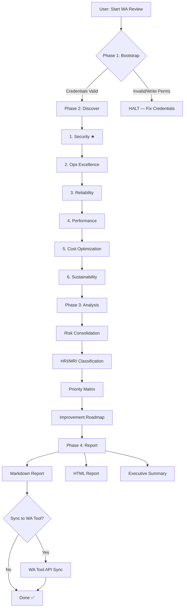

# Workflow Overview

## 4-Phase Automated Assessment Flow

## Phase Details

### Phase 1: Bootstrap (~2 minutes)
- **Human interaction**: YES (credential confirmation + scope selection)
- **Inputs**: AWS credentials, target account/region
- **Outputs**: Validated environment config
- **Can fail**: Yes — invalid credentials or write permissions detected

### Phase 2: Discover (~15-30 minutes)
- **Human interaction**: NO (fully automated)
- **Inputs**: Environment config from Phase 1
- **Outputs**: Per-pillar findings with severity ratings
- **Order**: Security ALWAYS first (Security-First principle)
- **Parallelism**: Sequential (one pillar at a time to manage API rate limits)

### Phase 3: Analysis (~5 minutes)
- **Human interaction**: NO
- **Inputs**: All pillar findings
- **Outputs**: Risk portfolio, priority matrix, improvement roadmap

### Phase 4: Report (~2 minutes)
- **Human interaction**: NO (optional WA Tool sync prompt)
- **Inputs**: Analysis results
- **Outputs**: Markdown report, HTML report, executive summary

## Security-First Principle

Security is ALWAYS assessed first because:
1. Security vulnerabilities can invalidate all other improvements
2. Security services (GuardDuty, CloudTrail) provide visibility for other pillars
3. Compliance requirements often mandate security baselines
4. Security incidents are exponentially more expensive than prevention

## Error Handling

| Error | Action |
|-------|--------|
| API throttling (429) | Exponential backoff (AWS CLI handles this) |
| Permission denied | Log as UNABLE_TO_ASSESS, not a finding |
| Service unavailable | Skip with region note |
| Timeout | Retry once, then skip |
| Credential expired | Prompt re-authentication |

## Assessment Depth

| Scope | Pillars | Estimated Time | Checks |
|-------|---------|----------------|--------|
| Quick Scan | Security only | ~5 min | ~25 |
| Focused | Security + 1-2 pillars | ~10-15 min | ~50-75 |
| Standard | All 6 pillars | ~20-30 min | ~150 |
| Deep Dive | All 6 + cross-pillar | ~30-45 min | ~200+ |
